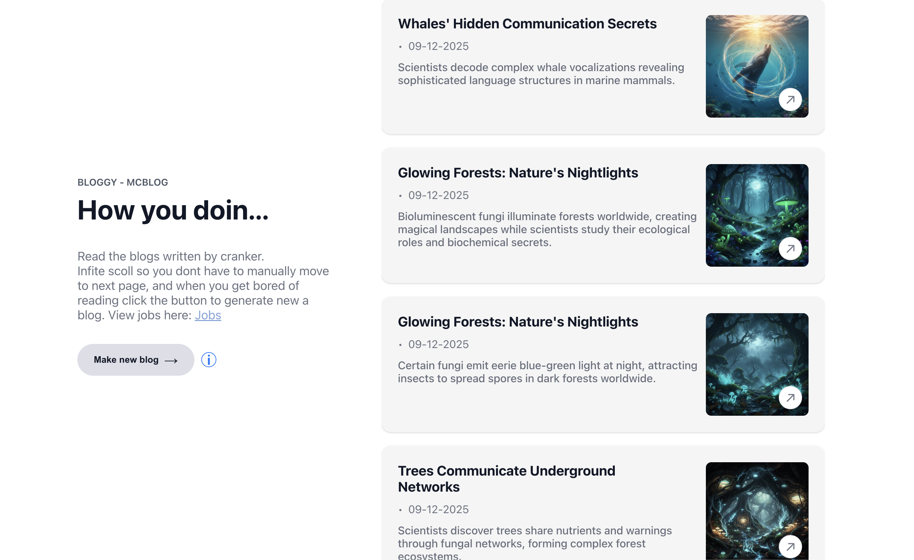
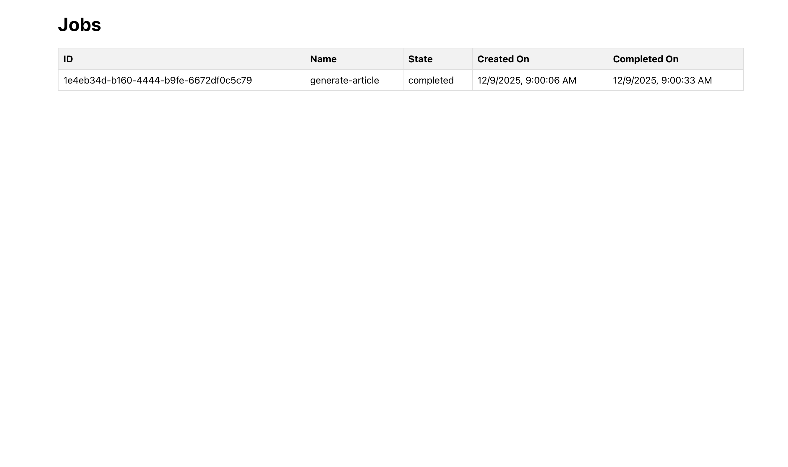

# Full Stack Blog Application

This is a full-stack blog application with a React frontend, a Node.js backend, and a PostgreSQL database. The application is containerized using Docker and deployed on AWS.

## File Structure

```
.
├── .github/workflows/deploy-ec2.yml
├── backend
│   ├── Dockerfile
│   ├── package.json
│   └── src
│       ├── config
│       │   ├── database.js
│       │   └── queue.js
│       ├── index.js
│       ├── models
│       │   └── Article.js
│       ├── routes
│       │   ├── articlesRoutes.js
│       │   └── jobsRoutes.js
│       ├── services
│       │   ├── articleJob.js
│       │   ├── articleService.js
│       │   └── jobService.js
│       └── workers
│           └── articleWorker.js
├── frontend
│   ├── Dockerfile
│   ├── nginx.conf
│   ├── package.json
│   └── src
│       ├── api
│       │   ├── articlesApi.js
│       │   └── jobsApi.js
│       ├── App.js
│       ├── components
│       │   ├── blogCard
│       │   │   └── BlogCard.jsx
│       │   └── blogList
│       │       └── BlogList.jsx
│       └── pages
│           ├── articleDetails
│           │   └── ArticleDetail.jsx
│           ├── home
│           │   └── Home.jsx
│           └── jobs
│               └── Jobs.jsx
└── infra
    ├── buildspec.yml
    ├── docker-compose.yml
    └── scripts
        └── deploy.sh
```

## Features

- View a list of articles
- View a single article
- Articles are automatically generated daily using an AI service
- View the status of background jobs

## Tech Stack

### Frontend

- **React:**

### Backend

- **Node.js:** 
- **Express:** 
- **Sequelize:**  ORM for database
- **PostgreSQL:**
- **pg-boss:** A job queue, uses PostgreSQL.
- **@openrouter/ai-sdk-provider:** Ai services used for generating articles.
- **@google/genai:** For blog images.


- **Docker:** For containerizing the application.


### Infrastructure

- **AWS EC2:** The application is deployed on an EC2 instance.
- **AWS CodeBuild:** Used for building the application.
- **GitHub Actions:** For CI/CD.

## Application Architecture

The application is composed of three main components:

- **Frontend:** A React application that provides the user interface for the blog. It communicates with the backend via a REST API.
- **Backend:** A Node.js application that provides the REST API for the frontend. It uses a PostgreSQL database for data storage and a job queue for background processing.

## Frontend Pages

The frontend application has the following pages:

- **Home (`/`):** Displays a list of articles.
- **Article Details (`/article/:id`):** Displays a single article.
- **Jobs (`/jobs`):** Displays the status of background jobs.
- **Not Found (`/404`):** A 404 page.

## Screenshots

### Home Page


### Jobs Board


## Getting Started / Local Development With Dockers

To get started with local development, you will need to have Docker and Docker Compose installed.

1.  **Clone the repository:**

    ```bash
    git clone -b main REPO_URL_HERE
    cd your-repository
    ```

2.  **Run the application using Docker Compose:**

    ```bash
    cd infra
    docker compose up --build
    ```


##  Local Development Without Dockers

1.  **Create a `.env` file in the `backend` directory with the following content:**

    ```
    DATABASE_URL=
    NODE_ENV=development
    OPENROUTER=
    GEMINI_API_KEY=
    ```
2.  **Create a `.env` file in the `frontend` directory with the following content:**

    ```
    REACT_APP_API_URL=
    ```
3.  **Run the application using npm :**
- for backend install packages and run command
    ```bash
    npm i
    npm run dev 
    ```
    - for forntend nstall packages and run command
    ```bash
    npm i
    npm start 
    ```
The frontend will be available at `http://localhost:3000` and the backend at `http://localhost:3001`.

## Deployment / CI/CD

This application is automatically deployed to an AWS EC2 instance when code is pushed to the `main` branch. The deployment process is managed by a GitHub Actions workflow defined in `.github/workflows/deploy-ec2.yml`.

The workflow consists of the following steps:

1.  **Configure AWS Credentials:** Configures the AWS credentials using secrets stored in GitHub.
2.  **Trigger AWS CodeBuild:** Triggers an AWS CodeBuild project to build the Docker images for the frontend and backend and push them to Amazon ECR.
3.  **Deploy to EC2:** SSH into the EC2 instance and runs the `deploy.sh` script located in the `infra/scripts` directory. This script pulls the latest Docker images from ECR and restarts the Docker containers.
